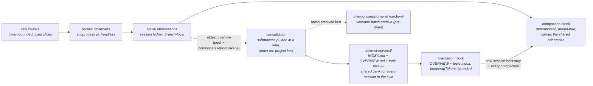

# observational-memory

Project-scoped, subprocess-backed memory for pi.

Parallel **observers** distill raw conversation chunks into atomic observations in a
session-local pool; a deterministic, model-free **compaction** renders that pool into the
compaction block; a **consolidator** promotes established observations into the **shared
durable bank** at `.memory/project/` (INDEX.md, OVERVIEW.md, topic files) — one bank per
working directory, reused by every session that starts there. Anything not promoted stays
in session-local archives, so speculation and half-finished work never become project
facts.

This fork implements **one memory model**. It is not a compatible mode of the upstream
[`amosblomqvist/pi-observational-memory`](https://github.com/amosblomqvist/pi-observational-memory)
(per-session `.memory/<sessionId>/` banks). Do not run upstream and this fork together in
the same project — that gives you two pipelines observing the same conversation, double
worker cost, and two competing memory models. If you want the old per-session behavior, use
upstream instead of this extension.

## On/off gate (default OFF)

The extension ships in the global extensions folder during development, so it is **gated off
per session** and is completely invisible until you turn it on.

- `/om` — toggle for this session
- `/om on` / `/om off` — set explicitly

State persists per session in the ledger (`om.enabled`) and survives resume. When off, every
trigger, hook, widget, and subprocess returns immediately.

## Storage layout

All memory lives under the current working directory (`ctx.cwd` — no Git-root search, no
project-identity layer). Three roots with different lifetimes:

```text
<cwd>/.memory/
├── project/                        shared durable bank — INDEX.md, OVERVIEW.md, <topic>.md,
│                                   plus .consolidation.lock (transient lock file)
├── sessions/<sessionId>/archive/   per-session archives of consolidator batches,
│                                   written verbatim before draining (persistent)
└── runtime/<sessionId>/runs/       transient worker IPC (result/cost files) — safe to
                                    clean periodically, never while workers are live
```

- **`project/` is the only durable recall tier.** Every session in this cwd reads it with
  ordinary `ls`/`read`/`grep`; the consolidator writes it through scoped tools confined to
  the bank. Sessions started in different subdirectories get different banks, even within
  one repository — to share memory, start pi from the same directory.
- **`sessions/<sessionId>/archive/`** holds each submitted batch verbatim (JSON, keyed by a
  deterministic batch id) before anything is drained. Anything the consolidator declines to
  promote is preserved there — but future sessions do not read it; it is recallable, not
  shared.
- **`runtime/`** is pure IPC — result and cost files for worker runs. It never holds durable
  memory.
- **No history in the bank.** No dates, session attribution, or change logs anywhere in
  `project/`; front matter is exactly `id`/`title`/`summary`. Git and session logs own
  history; the bank owns current knowledge.
- **No migration.** Old upstream `.memory/<sessionId>/` banks are simply never read.
- **Keep `.memory/` out of version control** (git-ignore it by choice — it stays local).
  In particular, the lock file and `runtime/` replay metadata must never be committed.

## How it works



- **Observer clock** (`turn_end` / `agent_start`): every `chunkTokens` of new raw history,
  cut a fixed-token slice and fire an observer subprocess. Observers are embarrassingly
  parallel pure mappers (capped by `observerConcurrency`); each commits its own
  `coversUpToId` watermark, so out-of-order completion is fine.
- **Observation** = `{ timestamp, content, tokenCount }`. The precise event-`timestamp`
  doubles as the id; the orchestrator re-derives a unique, second-resolution id at commit.
- **Consolidator clock** (`turn_end` / `agent_start`): when the active observation pool
  exceeds `consolidateAtPoolTokens`, a single background consolidator subprocess takes the
  **oldest** observations (above `poolTargetTokens`) and folds them into the shared bank.
  The dispatch order is strict:
  1. **Archive first** — the batch is written verbatim to `sessions/<id>/archive/` under a
     deterministic batch id *before anything is drained* (a retry of the same batch merges
     instead of duplicating). Secret-looking observations are screened out of both the
     archive and the submitted batch and counted as discarded — credentials never go to a
     subprocess.
  2. **Acquire the project lock** before reading the bank or building the prompt.
  3. Build the prompt from **fresh post-lock bank state** (current index + OVERVIEW + batch).
  4. Spawn the worker; it edits topic files and OVERVIEW.md via sandboxed tools and ends by
     calling `report_consolidation_outcomes`.
  5. **Validate the outcome contract**: the report must match the batch id and account for
     every submitted timestamp exactly once. Worker exit code 0 alone is *not* success; a
     missing or invalid report leaves the whole batch active and retryable (no tombstone).
  6. **Regenerate INDEX.md under the same lock, then tombstone last** — the acknowledgement
     lands only after validation *and* successful index generation, and only for
     observations still active on the originating branch. A crash between the index write
     and the tombstone leaves the batch active and retryable (the replay merges by batch
     id); a failed index write means no tombstone at all.
- **Promotion policy** (the consolidator's core rule): promote only *established current
  state, confirmed constraints, explicitly accepted decisions, durable conventions, and
  verified workarounds* — and only when the observations carry evidence for it. Speculation,
  proposed-but-unaccepted changes, abandoned approaches, and branch-specific work stay
  session-local (**retained**, preserved in the archive); pure noise is **discarded**. An
  accepted decision is recorded as accepted, never as done; conflicting claims are never
  resolved by arrival order. OVERVIEW.md is rewritten wholesale each run as an undated,
  current-state orientation — never a running history.
- **Compaction** (`turn_end` over `compactAtContextTokens`): deterministic and model-free.
  It waits for in-flight observers (or provably skips the wait when none can affect the
  result), snaps the cutoff to an observation chunk boundary, and renders: the **same
  orientation block bootstrap uses** (OVERVIEW + topic index, bounded by `bootstrapTokens`)
  + the active observations + a **session archive** section pointing at archived batches.
  A compaction that fires mid-run (with tool results pending) automatically resumes the
  agent afterwards (`resumeAfterMidRunCompaction`).
- **New-session bootstrap** (`before_agent_start`): the same bounded orientation block is
  injected once as a hidden message, so a fresh session starts oriented. Re-injection is
  fingerprint-deduped per session — the block is re-injected only when the bank *content*
  changed since the last injection, never every turn. An empty bank injects nothing; an
  unreadable bank skips injection with a warning and never blocks the turn.

Each worker is an **ordinary recorded pi session** in the global store
(`~/.pi/agent/sessions`) — open it in the session browser to see the exact input chunk, tool
calls, and output. Workers run with `cwd` set to the session's runtime dir, so they never
clutter the project's `/resume` picker.

## Short sessions: flush before you leave

Thresholds may never fire in a short session. **Run `/om:consolidate --flush` before ending
it** — it is the only guaranteed publish. The full pipeline, awaited synchronously:

1. One observer over the remaining uncovered conversation, even below `chunkTokens`;
2. Full-pool consolidation — *all* active observations, no overflow selection;
3. A bounded wait for the project lock (up to 60 s; on timeout it reports the holder and
   exits without spawning).

The final report carries promoted / retained / discarded counts plus the archive path, so
you know it is safe to leave. There is no automatic idle-time flush (a possible later
opt-in), and shutdown-time model calls are explicitly *not* relied upon — nothing runs at
exit.

## Concurrency: the project lock

Multiple pi processes in the same cwd share one bank, coordinated by a purely cooperative
lock file: `.memory/project/.consolidation.lock`, acquired by atomic exclusive create
before a consolidator touches the shared bank, released after the worker exits.

- **Background consolidation defers** when the lock is busy (no retry, no spawn; a later
  threshold trigger re-fires; the batch stays active).
- **`--flush` waits** — retried every 1.5 s, bounded at 60 s total (`PI_OM_FLUSH_LOCK_WAIT_MS`
  / `PI_OM_FLUSH_LOCK_RETRY_MS` env overrides), then reports busy.
- **Stale locks are reported, never stolen.** If the recorded pid is dead, `/om:status`
  flags the lock as stale; cleanup is **manual**: verify the pid is really dead, then delete
  `<cwd>/.memory/project/.consolidation.lock`. There is no heartbeat, lease, or automatic
  breaking.

**MVP limitation — consolidation is not transactional.** Individual file writes are atomic
(temp + rename), but a consolidator run edits several files sequentially; a reader may see a
mix of complete old and new files mid-run. INDEX.md is generated and rebuildable — it is
re-rendered from topic front-matter after every successful run, so deleting it is always
safe.

## Subagents and other launchers

- **Main agents publish; subagents only report.** Pi's subagent launcher sets
  `PI_SUBAGENT_ID` / `PI_SUBAGENT_SESSION`; such sessions register only stub commands
  ("OM is suppressed in subagent sessions") — no gate restore, no memory dirs, no triggers.
  A subagent's results reach the master through the normal `subagent_result` message, and
  the master's own observers see them.
- **Workers self-suppress**: `OM_WORKER` marks this extension's own subprocesses; the
  orchestrator never activates inside them (the worker extension `agent/index.ts` is the
  intentional in-process worker).
- **`PI_OM_PASSIVE=1`** is the opt-out for other launchers: it forces `passive` (all triggers
  disabled) while the rest of the extension initializes normally. User forks are plain main
  sessions — classification is by environment markers only.

## Commands

| Command | Effect |
|---|---|
| `/om`, `/om on`, `/om off` | The per-session on/off gate |
| `/om:status` | Workers in flight, active observations, next-observer progress, pool/consolidator state, topic-file count, overview size, lock state (incl. stale), context usage, session cost, last error |
| `/om:compact` | Force a compaction now (ignores the threshold) |
| `/om:consolidate` | Force an overflow-only consolidation now (everything above `poolTargetTokens`, ignoring the trigger threshold) |
| `/om:consolidate --flush` | Full publish before ending a session: tail observation + whole-pool consolidation, awaited, with a final report |

## Configuration

Namespace `observational-memory` in `~/.pi/agent/settings.json` (global) or
`.pi/settings.json` (project; overrides global):

```jsonc
{
  "observational-memory": {
    "chunkTokens": 10000,                // raw-history token size of one observation chunk
    "poolTargetTokens": 10000,           // buffer drains back toward this after consolidation
    "consolidateAtPoolTokens": 15000,    // pool size that triggers a consolidation
    "compactAtContextTokens": 150000,    // live context usage that triggers compaction
    "tailTokens": 20000,                 // verbatim tail; snaps to a chunk boundary
    "overviewTargetTokens": 1000,        // target size of OVERVIEW.md
    "bootstrapTokens": 2000,             // cap of the injected orientation block (bootstrap + compaction)
    "observerConcurrency": 4,
    "resumeAfterMidRunCompaction": true, // auto-resume after a mid-run compaction
    "models": {
      "observer":     { "provider": "openrouter", "id": "z-ai/glm-5.3", "thinking": "low" },
      "consolidator": { "provider": "openrouter", "id": "z-ai/glm-5.3", "thinking": "medium" }
    },
    "passive": false,
    "debugLog": false
  }
}
```

`PI_OM_PASSIVE=1` forces `passive` (disables all triggers) — a power-user setting distinct
from the on/off gate, useful for other launchers and clean `/tree` testing.

## Cost tracking

Every worker is a `pi` subprocess, so its spend is captured from pi's built-in
`usage.cost.total` and handed back via the run's cost file
(`.memory/runtime/<sessionId>/runs/<runId>.cost.json`). The orchestrator folds each run into
an `om.cost` ledger entry; the running total sums all entries across the whole session (every
branch), so real money spent never decreases under `/tree`. Surfaced in the footer and in
`/om:status` (`session cost: $X (N runs)`); survives resume.

## Development

```bash
npm install
npm test          # vitest
npm run typecheck # tsc --noEmit
```

Layout: `src/` is the master-side orchestrator (entry `src/index.ts`); `agent/` is the shared
worker extension loaded into subprocesses via `-e` (branching on `OM_WORKER`). Durable memory
lives under `<cwd>/.memory/project/`, session archives under
`<cwd>/.memory/sessions/<sessionId>/archive/`, transient worker IPC under
`<cwd>/.memory/runtime/<sessionId>/runs/`.